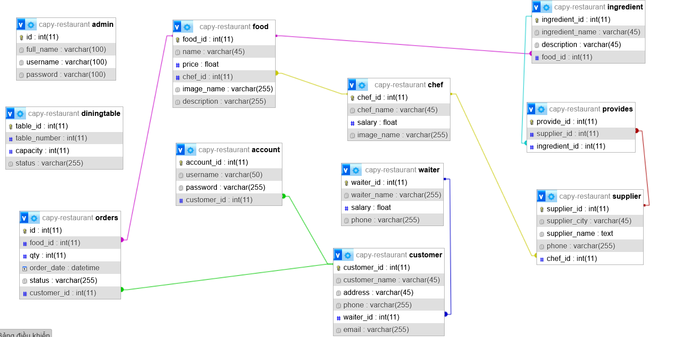

# Dự án Quản Lý Nhà Hàng

## Tên Website
- **Website Front**: [capyr.iceiy.com](http://capyr.iceiy.com)
- **Website Quản Lý**: [capyr.iceiy.com/admin](http://capyr.iceiy.com/admin)

## Mô Tả
Web quản lý nhà hàng, tập trung vào phần quản lý: thêm, sửa, xoá, thống kê dữ liệu. Phần trang front chỉ là phụ, dùng để tìm kiếm và thêm order vào phần quản lý.

## Database Schema

## Thành Viên Nhóm

### Nguyễn Đức Công
- Mã sinh viên: 23021482
- Làm trang quản lý:
  - Home
  - Admin
  - Foods
  - Chefs
  - Orders
- Làm trang front.

### Đỗ Trung Đức
- Mã sinh viên: 23021530
- Làm trang quản lý:
  - Customers
  - Dining Tables
  - Provides
  - Suppliers
  - Waiters
  - Ingredients
  - Accounts

## Hướng Dẫn Sử Dụng
Truy cập vào các đường dẫn ở trên.
